# 🗄️ PLAN DE ELIMINACIÓN - Campos Stripe en Base de Datos

## ⚠️ IMPORTANTE: ESTE ES SOLO UN PLAN - NO EJECUTAR SIN REVISIÓN

**Fecha de análisis**: 2025-10-27
**Estado actual**: Código Stripe eliminado, campos BD pendientes
**Entorno**: Railway (PostgreSQL)

---

## 📊 ANÁLISIS DE CONFIGURACIÓN ACTUAL

### Entorno Detectado

```
✅ Proyecto desplegado en Railway
✅ Base de datos: PostgreSQL (Railway)
✅ Deploy command: npx prisma db push --accept-data-loss
✅ No hay .env local (usa variables de entorno de Railway)
```

### Archivos de Configuración

| Archivo | Propósito |
|---------|-----------|
| `railway.json` | Configuración de build y deploy |
| `prisma/schema.prisma` | Schema de base de datos |
| `prisma/migrations/init/` | Migración inicial (incluye campos Stripe) |
| `prisma/migrations/z_add_stripe_integration_fields/` | Migración adicional Stripe para subscription_plans |

---

## 🔍 CAMPOS STRIPE IDENTIFICADOS

### Resumen

| Tabla | Campos Stripe | Nullable | Unique | Estado en Migración |
|-------|---------------|----------|--------|---------------------|
| **subscription_plans** | 2 campos | ✅ Sí | ❌ No | Agregados después (z_add_stripe) |
| **tenants** | 1 campo | ✅ Sí | ✅ Sí | Desde init |
| **tenant_subscriptions** | 2 campos | ✅ Sí | ❌ No | Desde init |
| **tenant_payments** | 2 campos | ✅ Sí | ❌ No | Desde init |
| **TOTAL** | **7 campos** | - | - | - |

---

## 📋 DETALLE DE CAMPOS POR TABLA

### 1. Tabla: `subscription_plans`

**Ubicación en schema**: Líneas 19-20

```prisma
model SubscriptionPlan {
  id              Int                  @id @default(autoincrement())
  name            String               @db.VarChar(50)
  description     String?
  price           Decimal              @db.Decimal(10, 2)
  currency        String               @default("MXN") @db.VarChar(3)
  billingPeriod   String               @default("monthly") @db.VarChar(20)
  invoiceLimit    Int
  isActive        Boolean              @default(true)

  // ❌ CAMPOS A ELIMINAR:
  stripeProductId String?              @map("stripe_product_id") @db.VarChar(100)
  stripePriceId   String?              @map("stripe_price_id") @db.VarChar(100)

  createdAt       DateTime             @default(now()) @map("created_at")
  updatedAt       DateTime             @default(now()) @map("updated_at")
  subscriptions   TenantSubscription[]

  @@map("subscription_plans")
}
```

**Campos SQL**:
- `stripe_product_id` VARCHAR(100) NULL
- `stripe_price_id` VARCHAR(100) NULL

**Origen**: Migración `z_add_stripe_integration_fields/migration.sql`

**Uso en código (YA ELIMINADO)**:
- ❌ `scripts/admin/create-subscription-plan.js` (ya actualizado)
- ❌ `jobs/subscription.job.js` (ya deshabilitado)

---

### 2. Tabla: `tenants`

**Ubicación en schema**: Línea 41

```prisma
model Tenant {
  id                      String               @id @default(uuid()) @db.Uuid
  businessName            String               @map("business_name") @db.VarChar(255)
  rfc                     String               @unique @db.VarChar(20)
  email                   String               @db.VarChar(255)
  phone                   String?              @db.VarChar(20)
  address                 String?
  contactName             String?              @map("contact_name") @db.VarChar(255)
  facturapiOrganizationId String?              @map("facturapi_organization_id") @db.VarChar(100)
  facturapiApiKey         String?              @map("facturapi_api_key") @db.VarChar(255)
  isActive                Boolean              @default(true) @map("is_active")
  createdAt               DateTime             @default(now()) @map("created_at")
  updatedAt               DateTime             @default(now()) @map("updated_at")

  // ❌ CAMPO A ELIMINAR:
  stripeCustomerId        String?              @unique @map("stripe_customer_id") @db.VarChar(100)

  // ... relaciones
  @@map("tenants")
}
```

**Campo SQL**:
- `stripe_customer_id` VARCHAR(100) NULL UNIQUE

**Índice asociado**:
- `tenants_stripe_customer_id_key` (UNIQUE INDEX)

**⚠️ IMPORTANTE**: Este campo tiene constraint UNIQUE, por lo que hay un índice que también debe eliminarse.

**Origen**: Migración `init/migration.sql` (línea 31)

**Uso en código (YA ELIMINADO)**:
- ❌ `jobs/subscription.job.js` (ya deshabilitado)

---

### 3. Tabla: `tenant_subscriptions`

**Ubicación en schema**: Líneas 79-80

```prisma
model TenantSubscription {
  id                    Int              @id @default(autoincrement())
  tenantId              String           @map("tenant_id") @db.Uuid
  planId                Int              @map("plan_id")

  // ❌ CAMPOS A ELIMINAR:
  stripeCustomerId      String?          @map("stripe_customer_id") @db.VarChar(100)
  stripeSubscriptionId  String?          @map("stripe_subscription_id") @db.VarChar(100)

  status                String           @default("trial") @db.VarChar(20)
  trialEndsAt           DateTime?        @map("trial_ends_at")
  currentPeriodStartsAt DateTime?        @map("current_period_starts_at")
  currentPeriodEndsAt   DateTime?        @map("current_period_ends_at")
  invoicesUsed          Int              @default(0) @map("invoices_used")
  createdAt             DateTime         @default(now()) @map("created_at")
  updatedAt             DateTime         @default(now()) @map("updated_at")

  // ... relaciones
  @@map("tenant_subscriptions")
}
```

**Campos SQL**:
- `stripe_customer_id` VARCHAR(100) NULL
- `stripe_subscription_id` VARCHAR(100) NULL

**Origen**: Migración `init/migration.sql` (líneas 57-58)

**Uso en código (YA ELIMINADO)**:
- ❌ `services/payment.service.js` (archivo eliminado)
- ❌ `jobs/subscription.job.js` (ya deshabilitado)

---

### 4. Tabla: `tenant_payments`

**Ubicación en schema**: Líneas 101-102

```prisma
model TenantPayment {
  id              Int                @id @default(autoincrement())
  tenantId        String             @map("tenant_id") @db.Uuid
  subscriptionId  Int                @map("subscription_id")
  amount          Decimal            @db.Decimal(10, 2)
  currency        String             @default("MXN") @db.VarChar(3)

  // ❌ CAMPOS A ELIMINAR:
  stripePaymentId String?            @map("stripe_payment_id") @db.VarChar(100)
  stripeInvoiceId String?            @map("stripe_invoice_id") @db.VarChar(100)

  paymentMethod   String?            @map("payment_method") @db.VarChar(50)
  status          String             @db.VarChar(20)
  paymentDate     DateTime?          @map("payment_date")
  createdAt       DateTime           @default(now()) @map("created_at")
  updatedAt       DateTime           @default(now()) @map("updated_at")

  // ... relaciones
  @@map("tenant_payments")
}
```

**Campos SQL**:
- `stripe_payment_id` VARCHAR(100) NULL
- `stripe_invoice_id` VARCHAR(100) NULL

**Origen**: Migración `init/migration.sql` (líneas 77-78)

**Uso en código (YA ELIMINADO)**:
- ❌ `services/payment.service.js` (archivo eliminado)

---

## ⚠️ RIESGOS Y CONSIDERACIONES

### 🔴 RIESGO CRÍTICO: Pérdida de Datos

**Pregunta clave**: ¿Hay datos en estos campos en producción?

```sql
-- ESTAS QUERIES SE DEBEN EJECUTAR EN RAILWAY ANTES DE PROCEDER
-- (Solo para verificación, NO para modificación)

-- 1. Verificar subscription_plans
SELECT
  COUNT(*) as total,
  COUNT(stripe_product_id) as con_product_id,
  COUNT(stripe_price_id) as con_price_id
FROM subscription_plans;

-- 2. Verificar tenants
SELECT
  COUNT(*) as total,
  COUNT(stripe_customer_id) as con_customer_id
FROM tenants;

-- 3. Verificar tenant_subscriptions
SELECT
  COUNT(*) as total,
  COUNT(stripe_customer_id) as con_customer_id,
  COUNT(stripe_subscription_id) as con_subscription_id
FROM tenant_subscriptions;

-- 4. Verificar tenant_payments
SELECT
  COUNT(*) as total,
  COUNT(stripe_payment_id) as con_payment_id,
  COUNT(stripe_invoice_id) as con_invoice_id
FROM tenant_payments;
```

### Decisión basada en datos:

| Escenario | Resultado | Acción |
|-----------|-----------|--------|
| **Todos los conteos = 0** | No hay datos Stripe | ✅ **SEGURO ELIMINAR** |
| **Algún conteo > 0** | Hay datos Stripe | ⚠️ **OPCIÓN A**: Backup + Eliminar<br>⚠️ **OPCIÓN B**: Mantener campos |

---

## 📝 PLAN DE ELIMINACIÓN

### OPCIÓN A: Eliminar Campos (Si NO hay datos)

#### Paso 1: Backup Completo

**⚠️ CRÍTICO: Hacer backup ANTES de cualquier cambio**

```bash
# En Railway CLI o interfaz web
# Exportar backup de PostgreSQL

# O desde línea de comandos (si tienes acceso):
pg_dump $DATABASE_URL > backup_pre_stripe_removal_$(date +%Y%m%d_%H%M%S).sql
```

#### Paso 2: Crear Migración de Eliminación

**Opción 2A: Usar Prisma Migrate (RECOMENDADO para Railway)**

```bash
# 1. Modificar schema.prisma (eliminar líneas de campos Stripe)
# 2. Crear migración
npx prisma migrate dev --create-only --name remove_stripe_fields

# 3. Revisar migración generada en:
# prisma/migrations/XXXXXXXX_remove_stripe_fields/migration.sql

# 4. Si todo se ve bien, aplicar:
npx prisma migrate deploy
```

**Opción 2B: Migración SQL Manual**

Crear archivo: `prisma/migrations/YYYYMMDD_remove_stripe_fields/migration.sql`

```sql
-- Migration: Remove Stripe fields from database
-- Date: YYYY-MM-DD
-- Author: [Tu nombre]
-- IMPORTANTE: Verificar backup antes de ejecutar

BEGIN;

-- 1. Eliminar índice único de tenants.stripe_customer_id
DROP INDEX IF EXISTS "tenants_stripe_customer_id_key";

-- 2. Eliminar campos de subscription_plans
ALTER TABLE "subscription_plans"
  DROP COLUMN IF EXISTS "stripe_product_id",
  DROP COLUMN IF EXISTS "stripe_price_id";

-- 3. Eliminar campo de tenants
ALTER TABLE "tenants"
  DROP COLUMN IF EXISTS "stripe_customer_id";

-- 4. Eliminar campos de tenant_subscriptions
ALTER TABLE "tenant_subscriptions"
  DROP COLUMN IF EXISTS "stripe_customer_id",
  DROP COLUMN IF EXISTS "stripe_subscription_id";

-- 5. Eliminar campos de tenant_payments
ALTER TABLE "tenant_payments"
  DROP COLUMN IF EXISTS "stripe_payment_id",
  DROP COLUMN IF EXISTS "stripe_invoice_id";

COMMIT;
```

#### Paso 3: Modificar schema.prisma

**Archivo**: `prisma/schema.prisma`

**Cambios a realizar**:

```diff
model SubscriptionPlan {
  id              Int                  @id @default(autoincrement())
  name            String               @db.VarChar(50)
  description     String?
  price           Decimal              @db.Decimal(10, 2)
  currency        String               @default("MXN") @db.VarChar(3)
  billingPeriod   String               @default("monthly") @db.VarChar(20)
  invoiceLimit    Int
  isActive        Boolean              @default(true)
- stripeProductId String?              @map("stripe_product_id") @db.VarChar(100)
- stripePriceId   String?              @map("stripe_price_id") @db.VarChar(100)
  createdAt       DateTime             @default(now()) @map("created_at")
  updatedAt       DateTime             @default(now()) @map("updated_at")
  subscriptions   TenantSubscription[]

  @@map("subscription_plans")
}

model Tenant {
  id                      String               @id @default(uuid()) @db.Uuid
  businessName            String               @map("business_name") @db.VarChar(255)
  rfc                     String               @unique @db.VarChar(20)
  email                   String               @db.VarChar(255)
  phone                   String?              @db.VarChar(20)
  address                 String?
  contactName             String?              @map("contact_name") @db.VarChar(255)
  facturapiOrganizationId String?              @map("facturapi_organization_id") @db.VarChar(100)
  facturapiApiKey         String?              @map("facturapi_api_key") @db.VarChar(255)
  isActive                Boolean              @default(true) @map("is_active")
  createdAt               DateTime             @default(now()) @map("created_at")
  updatedAt               DateTime             @default(now()) @map("updated_at")
- stripeCustomerId        String?              @unique @map("stripe_customer_id") @db.VarChar(100)
  // ... relaciones

  @@map("tenants")
}

model TenantSubscription {
  id                    Int              @id @default(autoincrement())
  tenantId              String           @map("tenant_id") @db.Uuid
  planId                Int              @map("plan_id")
- stripeCustomerId      String?          @map("stripe_customer_id") @db.VarChar(100)
- stripeSubscriptionId  String?          @map("stripe_subscription_id") @db.VarChar(100)
  status                String           @default("trial") @db.VarChar(20)
  // ... resto

  @@map("tenant_subscriptions")
}

model TenantPayment {
  id              Int                @id @default(autoincrement())
  tenantId        String             @map("tenant_id") @db.Uuid
  subscriptionId  Int                @map("subscription_id")
  amount          Decimal            @db.Decimal(10, 2)
  currency        String             @default("MXN") @db.VarChar(3)
- stripePaymentId String?            @map("stripe_payment_id") @db.VarChar(100)
- stripeInvoiceId String?            @map("stripe_invoice_id") @db.VarChar(100)
  paymentMethod   String?            @map("payment_method") @db.VarChar(50)
  // ... resto

  @@map("tenant_payments")
}
```

#### Paso 4: Aplicar en Railway

**Método de aplicación depende del uso de Prisma Migrate**:

##### Si usas Prisma Migrate:

```bash
# Deploy a Railway
git add prisma/
git commit -m "refactor: remove Stripe fields from database schema"
git push origin main

# Railway ejecutará automáticamente:
# npx prisma db push --accept-data-loss
```

##### Si usas migraciones manuales:

```bash
# Conectarse a Railway PostgreSQL
railway connect postgres

# Ejecutar migración SQL manualmente
\i prisma/migrations/YYYYMMDD_remove_stripe_fields/migration.sql

# Verificar cambios
\d subscription_plans
\d tenants
\d tenant_subscriptions
\d tenant_payments
```

#### Paso 5: Generar Cliente Prisma Actualizado

```bash
npx prisma generate
```

#### Paso 6: Verificar Aplicación

```bash
# Iniciar aplicación localmente para verificar
npm run dev

# O verificar en Railway que el deploy fue exitoso
railway logs
```

---

### OPCIÓN B: Mantener Campos (Si HAY datos)

Si hay datos en los campos Stripe en producción:

#### Opción B1: Mantener Todo

**Acción**: No hacer nada en BD, solo documentar.

**Crear archivo**: `docs/STRIPE_LEGACY_FIELDS.md`

```markdown
# Campos Legacy de Stripe en Base de Datos

## Estado
Los siguientes campos fueron parte de una integración Stripe que ya no se usa.
Se mantienen en la base de datos por datos históricos.

## Campos Preservados

- `subscription_plans.stripe_product_id`
- `subscription_plans.stripe_price_id`
- `tenants.stripe_customer_id`
- `tenant_subscriptions.stripe_customer_id`
- `tenant_subscriptions.stripe_subscription_id`
- `tenant_payments.stripe_payment_id`
- `tenant_payments.stripe_invoice_id`

## Fecha de desuso
2025-10-27

## Próximos pasos
Evaluar eliminación cuando se confirme que los datos no son necesarios.
```

#### Opción B2: Backup y Limpiar Datos

```sql
-- 1. Crear tabla de backup con datos Stripe
CREATE TABLE stripe_legacy_backup AS
SELECT
  t.id as tenant_id,
  t.stripe_customer_id,
  ts.id as subscription_id,
  ts.stripe_customer_id as sub_stripe_customer_id,
  ts.stripe_subscription_id,
  tp.id as payment_id,
  tp.stripe_payment_id,
  tp.stripe_invoice_id,
  NOW() as backed_up_at
FROM tenants t
LEFT JOIN tenant_subscriptions ts ON t.id = ts.tenant_id
LEFT JOIN tenant_payments tp ON ts.id = tp.subscription_id
WHERE
  t.stripe_customer_id IS NOT NULL
  OR ts.stripe_customer_id IS NOT NULL
  OR ts.stripe_subscription_id IS NOT NULL
  OR tp.stripe_payment_id IS NOT NULL
  OR tp.stripe_invoice_id IS NOT NULL;

-- 2. Limpiar datos (poner NULL)
UPDATE subscription_plans SET
  stripe_product_id = NULL,
  stripe_price_id = NULL
WHERE stripe_product_id IS NOT NULL OR stripe_price_id IS NOT NULL;

UPDATE tenants SET stripe_customer_id = NULL WHERE stripe_customer_id IS NOT NULL;

UPDATE tenant_subscriptions SET
  stripe_customer_id = NULL,
  stripe_subscription_id = NULL
WHERE stripe_customer_id IS NOT NULL OR stripe_subscription_id IS NOT NULL;

UPDATE tenant_payments SET
  stripe_payment_id = NULL,
  stripe_invoice_id = NULL
WHERE stripe_payment_id IS NOT NULL OR stripe_invoice_id IS NOT NULL;

-- 3. Verificar backup
SELECT COUNT(*) FROM stripe_legacy_backup;

-- 4. LUEGO ejecutar OPCIÓN A para eliminar campos
```

---

## 🚀 EJECUCIÓN RECOMENDADA

### Flujo de Trabajo

```mermaid
graph TD
    A[Inicio] --> B[Verificar datos en BD]
    B --> C{¿Hay datos Stripe?}
    C -->|NO| D[OPCIÓN A: Eliminar]
    C -->|SÍ| E[¿Necesarios datos?]
    E -->|NO| F[Backup + Limpiar + OPCIÓN A]
    E -->|SÍ| G[OPCIÓN B: Mantener]
    D --> H[1. Backup BD completo]
    F --> H
    H --> I[2. Modificar schema.prisma]
    I --> J[3. Crear migración]
    J --> K[4. Probar en staging]
    K --> L{¿Funciona?}
    L -->|SÍ| M[5. Deploy a Railway]
    L -->|NO| N[Rollback y revisar]
    M --> O[6. Verificar deploy]
    O --> P[7. Monitorear logs]
    P --> Q[Fin]
    G --> R[Documentar decisión]
    R --> Q
    N --> I
```



---

## ✅ CHECKLIST DE PRE-EJECUCIÓN

Antes de ejecutar cualquier cambio:

- [ ] ✅ Backup completo de base de datos Railway descargado
- [ ] ✅ Queries de verificación ejecutadas (conteo de datos)
- [ ] ✅ Decisión tomada (OPCIÓN A o B)
- [ ] ✅ Schema Prisma modificado (si OPCIÓN A)
- [ ] ✅ Migración creada y revisada (si OPCIÓN A)
- [ ] ✅ Equipo notificado del cambio
- [ ] ✅ Ventana de mantenimiento programada (si aplica)
- [ ] ✅ Plan de rollback documentado

---

## 🔙 PLAN DE ROLLBACK

Si algo sale mal:

### Rollback de Código

```bash
# Revertir commit
git revert HEAD
git push origin main

# Railway hará redeploy automático
```

### Rollback de Base de Datos

```bash
# Restaurar desde backup
pg_restore -d $DATABASE_URL backup_pre_stripe_removal_YYYYMMDD_HHMMSS.sql

# O ejecutar migración inversa
```

**Migración inversa** (`rollback_stripe_fields.sql`):

```sql
-- Recrear campos eliminados
BEGIN;

ALTER TABLE "subscription_plans"
  ADD COLUMN IF NOT EXISTS "stripe_product_id" VARCHAR(100),
  ADD COLUMN IF NOT EXISTS "stripe_price_id" VARCHAR(100);

ALTER TABLE "tenants"
  ADD COLUMN IF NOT EXISTS "stripe_customer_id" VARCHAR(100);

ALTER TABLE "tenant_subscriptions"
  ADD COLUMN IF NOT EXISTS "stripe_customer_id" VARCHAR(100),
  ADD COLUMN IF NOT EXISTS "stripe_subscription_id" VARCHAR(100);

ALTER TABLE "tenant_payments"
  ADD COLUMN IF NOT EXISTS "stripe_payment_id" VARCHAR(100),
  ADD COLUMN IF NOT EXISTS "stripe_invoice_id" VARCHAR(100);

-- Recrear índice único
CREATE UNIQUE INDEX IF NOT EXISTS "tenants_stripe_customer_id_key"
ON "tenants"("stripe_customer_id")
WHERE "stripe_customer_id" IS NOT NULL AND "stripe_customer_id" != '';

COMMIT;
```

---

## 📊 MÉTRICAS DE IMPACTO ESPERADAS

### Si se ejecuta OPCIÓN A:

| Métrica | Antes | Después | Cambio |
|---------|-------|---------|--------|
| **Columnas totales** | ~100 | ~93 | -7 |
| **Índices** | ~X | ~X-1 | -1 |
| **Tamaño schema** | Variable | -5% aprox | Reducción |
| **Queries con campos Stripe** | 0 | 0 | Sin cambio |

### Código afectado:

**✅ YA ACTUALIZADO** (en commit anterior):
- Todos los archivos ya no usan estos campos
- No hay queries que referencien campos Stripe
- No hay validaciones que dependan de estos campos

---

## 📞 CONTACTO Y SOPORTE

### Antes de Ejecutar

1. **Revisar este plan completamente**
2. **Ejecutar queries de verificación en Railway**
3. **Tomar decisión informada**
4. **Hacer backup completo**
5. **Proceder con cautela**

### Durante la Ejecución

- Monitorear logs de Railway
- Verificar que aplicación siga funcionando
- Verificar queries de la aplicación

### Después de la Ejecución

- Verificar que no hay errores en logs
- Confirmar que aplicación funciona correctamente
- Documentar resultado

---

## 📝 CONCLUSIÓN

### Estado Actual:
- ✅ Código Stripe: **ELIMINADO**
- ⏳ Campos BD: **PENDIENTE DE DECISIÓN**

### Próximo Paso:
1. **TÚ ejecutas** queries de verificación en Railway
2. **TÚ decides** si hay datos importantes
3. **TÚ ejecutas** OPCIÓN A o B según decisión
4. **YO puedo ayudar** a crear la migración específica cuando decidas

---

**Documento creado**: 2025-10-27
**Autor**: Claude Code Assistant
**Versión**: 1.0
**Estado**: PLAN NO EJECUTADO
