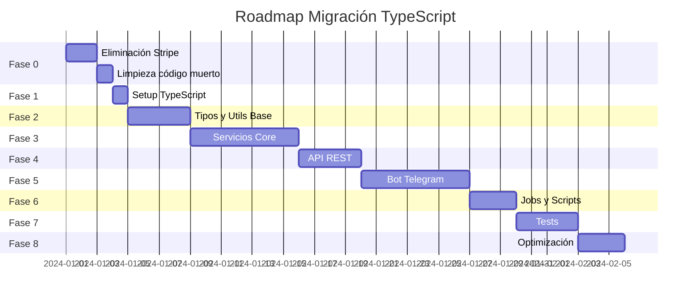

# 🚀 ROADMAP COMPLETO: MIGRACIÓN A TYPESCRIPT Y ELIMINACIÓN DE STRIPE

## 📋 RESUMEN EJECUTIVO

### Objetivos Principales

1. ✅ Eliminar completamente Stripe del proyecto
2. ✅ Migrar 100% del código JavaScript a TypeScript
3. ✅ Eliminar todo código muerto y duplicado
4. ✅ Establecer tipos estrictos y seguros
5. ✅ Mantener funcionalidad sin interrupciones

### Duración Estimada

- **Total**: 5-7 semanas (25-35 días laborables)
- **Equipo**: 2-3 desarrolladores senior
- **Modalidad**: Sprints de 1 semana

### Métricas de Éxito

- 0 referencias a Stripe en el código
- 100% archivos .ts (excepto configs especiales)
- > 95% type coverage
- 0 'any' types (salvo justificados)
- Tests pasando 100%
- Sin degradación de performance

---

## 🗓️ TIMELINE GENERAL



---

## 📅 FASE 0: PREPARACIÓN Y LIMPIEZA (Días 1-3)

### 🎯 Objetivo

Limpiar el proyecto de Stripe y código innecesario antes de comenzar la migración.

### 📋 Tareas Detalladas

#### Día 1: Eliminación de Stripe

- [ ] Crear branch `feature/remove-stripe`
- [ ] Eliminar archivos completos (7 archivos):
  ```bash
  rm services/stripe.service.js
  rm services/payment.service.js
  rm scripts/admin/update-plan-price.js
  rm tests/validate-stripe-webhook.js
  rm tests/payment.service.test.js
  rm -rf docs/analysis/STRIPE_*.md
  ```
- [ ] Crear migración de base de datos:

  ```sql
  -- migrations/remove_stripe_fields.sql
  ALTER TABLE subscription_plans
    DROP COLUMN stripe_product_id,
    DROP COLUMN stripe_price_id;

  ALTER TABLE tenants
    DROP COLUMN stripe_customer_id;

  ALTER TABLE tenant_subscriptions
    DROP COLUMN stripe_customer_id,
    DROP COLUMN stripe_subscription_id;

  ALTER TABLE tenant_payments
    DROP COLUMN stripe_payment_id,
    DROP COLUMN stripe_invoice_id;
  ```

#### Día 2: Refactorización de archivos afectados

- [ ] **webhook.controller.js**: Eliminar función `handleStripeWebhook` (líneas 22-104)
- [ ] **webhook.routes.js**: Eliminar línea 8
- [ ] **subscription.job.js**: Refactorizar para eliminar lógica Stripe (líneas 139-287)
- [ ] **config/services.js**: Eliminar líneas 43-54 y 69-80
- [ ] **config/index.js**: Eliminar import línea 7 y referencia línea 138
- [ ] **tenant.service.js**: Eliminar función `generatePaymentLink` (líneas 296-341)
- [ ] **.env.example**: Eliminar variables Stripe (líneas 21-24)
- [ ] **package.json**: Eliminar dependencia stripe
- [ ] Ejecutar `npm install` para actualizar lock file

#### Día 3: Limpieza de código duplicado y validación

- [ ] Consolidar `tenant.service.js` y `tenant.service.optimized.js`
- [ ] Añadir `/frontend/node_modules/.cache` a .gitignore
- [ ] Eliminar tests sin assertions o incompletos
- [ ] Ejecutar suite completa de tests
- [ ] Validar que no hay referencias a Stripe:
  ```bash
  grep -r "stripe\|Stripe\|STRIPE" --exclude-dir=node_modules --exclude-dir=.git .
  ```
- [ ] Commit y PR de revisión

### ✅ Criterios de Aceptación Fase 0

- No existen referencias a Stripe en el código
- Todos los tests pasan
- La aplicación funciona correctamente sin pagos
- Base de datos migrada sin campos Stripe

---

## 📅 FASE 1: CONFIGURACIÓN TYPESCRIPT (Día 4)

### 🎯 Objetivo

Establecer la configuración base de TypeScript para permitir migración incremental.

### 📋 Tareas Detalladas

#### Configuración Inicial

- [ ] Instalar dependencias:

  ```bash
  npm install --save-dev typescript @types/node ts-node ts-node-dev
  npm install --save-dev @types/express @types/jest @types/pino
  npm install --save-dev @typescript-eslint/parser @typescript-eslint/eslint-plugin
  ```

- [ ] Crear `tsconfig.json`:

  ```json
  {
    "compilerOptions": {
      "target": "ES2022",
      "module": "ESNext",
      "lib": ["ES2022"],
      "moduleResolution": "node",
      "baseUrl": ".",
      "paths": {
        "@/*": ["./*"],
        "@services/*": ["./services/*"],
        "@core/*": ["./core/*"],
        "@api/*": ["./api/*"],
        "@bot/*": ["./bot/*"],
        "@config/*": ["./config/*"],
        "@types/*": ["./types/*"]
      },
      "allowJs": true,
      "checkJs": false,
      "outDir": "./dist",
      "rootDir": "./",
      "removeComments": true,
      "strict": false,
      "esModuleInterop": true,
      "skipLibCheck": true,
      "forceConsistentCasingInFileNames": true,
      "resolveJsonModule": true,
      "allowSyntheticDefaultImports": true,
      "declaration": true,
      "declarationMap": true,
      "sourceMap": true,
      "noImplicitAny": false,
      "strictNullChecks": false,
      "strictFunctionTypes": false,
      "experimentalDecorators": true,
      "emitDecoratorMetadata": true
    },
    "include": ["**/*.ts", "**/*.js"],
    "exclude": ["node_modules", "dist", "frontend", "**/*.test.ts", "**/*.test.js"]
  }
  ```

- [ ] Crear `tsconfig.build.json`:

  ```json
  {
    "extends": "./tsconfig.json",
    "exclude": ["**/*.test.ts", "**/*.test.js", "tests", "scripts"]
  }
  ```

- [ ] Actualizar scripts en `package.json`:

  ```json
  {
    "scripts": {
      "dev": "ts-node-dev --respawn --transpile-only server.js",
      "build": "tsc -p tsconfig.build.json",
      "typecheck": "tsc --noEmit",
      "lint": "eslint . --ext .js,.ts",
      "test": "jest",
      "test:types": "tsc --noEmit --skipLibCheck"
    }
  }
  ```

- [ ] Configurar ESLint para TypeScript (`.eslintrc.json`)
- [ ] Crear estructura de tipos base:
  ```bash
  mkdir -p types/{api,bot,core,services}
  touch types/index.d.ts
  touch types/global.d.ts
  ```

### ✅ Criterios de Aceptación Fase 1

- El proyecto compila con `npm run build`
- Los tests siguen pasando
- ESLint funciona con archivos .ts
- La aplicación arranca con `npm run dev`

---

## 📅 FASE 2: TIPOS Y UTILIDADES BASE (Días 5-8)

### 🎯 Objetivo

Crear sistema de tipos fundamental y migrar utilidades core.

### 📋 Tareas Detalladas

#### Día 5: Tipos Globales y de Dominio

- [ ] Crear `/types/global.d.ts`:

  ```typescript
  declare global {
    namespace NodeJS {
      interface ProcessEnv {
        NODE_ENV: 'development' | 'production' | 'test';
        DATABASE_URL: string;
        REDIS_URL: string;
        JWT_SECRET: string;
        TELEGRAM_BOT_TOKEN: string;
        FACTURAPI_TEST_KEY: string;
        FACTURAPI_PROD_KEY: string;
        // ... resto de variables
      }
    }
  }
  ```

- [ ] Crear `/types/domain.ts`:

  ```typescript
  // Tipos de negocio fundamentales
  export interface Tenant {
    id: string;
    name: string;
    rfc: string;
    isProduction: boolean;
    apiKeyEncrypted?: string;
    createdAt: Date;
    updatedAt: Date;
  }

  export interface TenantUser {
    id: string;
    tenantId: string;
    telegramId: string;
    username?: string;
    role: 'admin' | 'user';
    isActive: boolean;
  }

  export interface Invoice {
    id: string;
    tenantId: string;
    facturApiId: string;
    folio: number;
    series: string;
    customer: any; // TODO: Tipar después
    items: InvoiceItem[];
    total: number;
    status: InvoiceStatus;
  }

  export type InvoiceStatus = 'draft' | 'valid' | 'cancelled';
  ```

#### Día 6: Tipos de API y Bot

- [ ] Crear `/types/api/index.ts`:

  ```typescript
  import { Request, Response } from 'express';
  import { Tenant, TenantUser } from '../domain';

  export interface AuthRequest extends Request {
    user?: TenantUser;
    tenant?: Tenant;
    tenantId?: string;
  }

  export interface ApiResponse<T = any> {
    success: boolean;
    data?: T;
    error?: {
      code: string;
      message: string;
      details?: any;
    };
    pagination?: {
      page: number;
      limit: number;
      total: number;
      pages: number;
    };
  }
  ```

- [ ] Crear `/types/bot/index.ts`:

  ```typescript
  import { Context } from 'telegraf';
  import { Tenant, TenantUser } from '../domain';

  export interface BotContext extends Context {
    tenant?: Tenant;
    user?: TenantUser;
    session?: SessionData;
    sessionDB?: any; // Redis session
  }

  export interface SessionData {
    tenantId?: string;
    userId?: string;
    currentFlow?: string;
    tempData?: Record<string, any>;
    pdfAnalysis?: any;
    // ... más campos
  }
  ```

#### Día 7: Migración de Utilidades Core

- [ ] Migrar `/core/utils/logger.js` → `.ts`:

  ```typescript
  import pino from 'pino';

  export interface LoggerOptions {
    module?: string;
    tenantId?: string;
    userId?: string;
  }

  const logger = pino({
    level: process.env.LOG_LEVEL || 'info',
    // ... configuración
  });

  export default logger;
  ```

- [ ] Migrar `/core/utils/encryption.js` → `.ts`
- [ ] Migrar `/core/utils/transaction.js` → `.ts`
- [ ] Migrar `/core/utils/state-cleanup.utils.js` → `.ts`
- [ ] Migrar `/core/utils/batch-progress.utils.js` → `.ts`

#### Día 8: Configuración y Validación

- [ ] Migrar `/config/index.js` → `.ts` con validación Zod:

  ```typescript
  import { z } from 'zod';

  const configSchema = z.object({
    app: z.object({
      name: z.string(),
      version: z.string(),
      env: z.enum(['development', 'production', 'test']),
    }),
    server: z.object({
      port: z.number(),
      host: z.string(),
    }),
    // ... resto de config
  });

  export type Config = z.infer<typeof configSchema>;
  ```

- [ ] Migrar `/config/auth.js` → `.ts`
- [ ] Migrar `/config/database.js` → `.ts`
- [ ] Migrar `/config/services.js` → `.ts`
- [ ] Actualizar imports en archivos que usen estas utilidades

### ✅ Criterios de Aceptación Fase 2

- Sistema de tipos base establecido
- Todas las utilidades core migradas a TS
- Configuración tipada y validada
- Sin errores de compilación TypeScript
- Tests siguen pasando

---

## 📅 FASE 3: SERVICIOS CORE (Días 9-15)

### 🎯 Objetivo

Migrar todos los servicios críticos del negocio a TypeScript con tipos estrictos.

### 📋 Tareas Detalladas

#### Día 9: Servicio de FacturAPI

- [ ] Crear tipos para FacturAPI:

  ```typescript
  // types/services/facturapi.types.ts
  export interface FacturApiCustomer {
    id: string;
    legal_name: string;
    tax_id: string;
    email: string;
    address: FacturApiAddress;
  }

  export interface FacturApiInvoice {
    id: string;
    folio_number: number;
    series: string;
    customer: string | FacturApiCustomer;
    items: FacturApiItem[];
    payment_form: string;
    payment_method: string;
    use: string;
    status: 'valid' | 'draft' | 'cancelled';
  }
  ```

- [ ] Migrar `services/facturapi.service.js` → `.ts`
- [ ] Agregar manejo de errores tipado
- [ ] Actualizar todos los imports

#### Día 10: Servicio de Tenant

- [ ] Consolidar y migrar `services/tenant.service.js` → `.ts`
- [ ] Eliminar `tenant.service.optimized.js`
- [ ] Implementar interfaces para métodos:
  ```typescript
  interface TenantService {
    findByTelegramId(telegramId: string): Promise<Tenant | null>;
    getNextFolio(tenantId: string, series?: string): Promise<number>;
    validateApiKey(tenantId: string): Promise<boolean>;
    // ... más métodos
  }
  ```

#### Día 11: Servicio de Redis/Sesiones

- [ ] Migrar `services/redis-session.service.js` → `.ts`
- [ ] Crear tipos para sesiones:
  ```typescript
  interface RedisSessionData {
    tenantId: string;
    userId: string;
    expiresAt: number;
    data: Record<string, any>;
  }
  ```
- [ ] Migrar `core/auth/session.service.js` → `.ts`

#### Día 12: Servicios de Notificación y Folios

- [ ] Migrar `services/notification.service.js` → `.ts`
- [ ] Migrar `services/folio.service.js` → `.ts`
- [ ] Crear tipos para notificaciones:
  ```typescript
  interface NotificationPayload {
    type: 'info' | 'warning' | 'error' | 'success';
    title: string;
    message: string;
    metadata?: Record<string, any>;
  }
  ```

#### Día 13: Servicios de Procesamiento

- [ ] Migrar `services/pdf-analysis.service.js` → `.ts`
- [ ] Migrar `services/batch-processor.service.js` → `.ts`
- [ ] Migrar `services/retry.service.js` → `.ts`
- [ ] Crear decoradores TypeScript para retry

#### Día 14: Servicios de Cliente y Factura

- [ ] Migrar `services/client.service.js` → `.ts`
- [ ] Migrar `services/invoice.service.js` → `.ts`
- [ ] Migrar `services/zip-generator.service.js` → `.ts`

#### Día 15: Servicios Restantes y Validación

- [ ] Migrar `services/reports.service.js` → `.ts`
- [ ] Migrar `services/customer-setup.service.js` → `.ts`
- [ ] Migrar servicios faltantes
- [ ] Ejecutar validación completa:
  ```bash
  npm run typecheck
  npm test
  ```

### ✅ Criterios de Aceptación Fase 3

- Todos los servicios migrados a TypeScript
- Interfaces claras para cada servicio
- Sin uso de `any` en servicios críticos
- Manejo de errores tipado
- Tests de servicios pasando

---

## 📅 FASE 4: API REST (Días 16-19)

### 🎯 Objetivo

Migrar toda la capa API a TypeScript con tipos seguros end-to-end.

### 📋 Tareas Detalladas

#### Día 16: Middlewares

- [ ] Crear tipos base para middlewares:

  ```typescript
  // types/api/middleware.types.ts
  import { Request, Response, NextFunction } from 'express';

  export type AsyncMiddleware = (req: Request, res: Response, next: NextFunction) => Promise<void>;

  export interface ErrorMiddleware {
    (err: Error, req: Request, res: Response, next: NextFunction): void;
  }
  ```

- [ ] Migrar middlewares en orden:
  - [ ] `api/middlewares/error.middleware.js` → `.ts`
  - [ ] `api/middlewares/auth.middleware.js` → `.ts`
  - [ ] `api/middlewares/tenant.middleware.js` → `.ts`
  - [ ] `api/middlewares/validation.middleware.js` → `.ts`
  - [ ] `api/middlewares/rate-limit.middleware.js` → `.ts`
  - [ ] `api/middlewares/session.middleware.js` → `.ts`

#### Día 17: Controladores - Parte 1

- [ ] Crear tipos para DTOs:

  ```typescript
  // types/api/dto/index.ts
  export interface CreateInvoiceDTO {
    customerId: string;
    items: Array<{
      product: string;
      quantity: number;
      price: number;
    }>;
    paymentForm: string;
    paymentMethod: string;
  }

  export interface LoginDTO {
    username: string;
    password: string;
  }
  ```

- [ ] Migrar controladores principales:
  - [ ] `api/controllers/auth.controller.js` → `.ts`
  - [ ] `api/controllers/client.controller.js` → `.ts`

#### Día 18: Controladores - Parte 2

- [ ] Migrar controladores restantes:
  - [ ] `api/controllers/invoice.controller.js` → `.ts`
  - [ ] `api/controllers/product.controller.js` → `.ts`
  - [ ] `api/controllers/webhook.controller.js` → `.ts`
- [ ] Implementar validación con Zod en controladores

#### Día 19: Rutas y API Index

- [ ] Migrar todas las rutas:
  - [ ] `api/routes/auth.routes.js` → `.ts`
  - [ ] `api/routes/client.routes.js` → `.ts`
  - [ ] `api/routes/invoice.routes.js` → `.ts`
  - [ ] `api/routes/product.routes.js` → `.ts`
  - [ ] `api/routes/webhook.routes.js` → `.ts`
  - [ ] `api/routes/cluster.routes.js` → `.ts`
  - [ ] `api/routes/index.js` → `.ts`
- [ ] Migrar `api/index.js` → `.ts`
- [ ] Agregar tipos para respuestas API

### ✅ Criterios de Aceptación Fase 4

- API completamente migrada a TypeScript
- Tipos seguros en request/response
- Validación de DTOs con tipos
- Middlewares tipados correctamente
- API funcionando sin errores

---

## 📅 FASE 5: BOT DE TELEGRAM (Días 20-26)

### 🎯 Objetivo

Migrar todo el bot de Telegram a TypeScript con contexto extendido tipado.

### 📋 Tareas Detalladas

#### Día 20: Setup y Tipos del Bot

- [ ] Instalar tipos de Telegraf:

  ```bash
  npm install --save-dev @types/telegraf
  ```

- [ ] Crear tipos extendidos para el bot:

  ```typescript
  // types/bot/context.types.ts
  import { Context, Scenes } from 'telegraf';

  interface SessionData {
    currentFlow?: string;
    tenantId?: string;
    userId?: string;
    tempData?: Record<string, any>;
    pdfAnalysis?: PdfAnalysisResult;
    // ... más campos
  }

  export interface BotContext extends Context {
    scene: Scenes.SceneContextScene<BotContext>;
    session: SessionData;
    tenant?: Tenant;
    user?: TenantUser;
    // Métodos custom
    replyWithMarkdown(text: string): Promise<any>;
  }
  ```

#### Día 21: Middlewares y Comandos Base

- [ ] Migrar middlewares del bot:

  - [ ] `bot/middlewares/auth.middleware.js` → `.ts`
  - [ ] `bot/middlewares/error.middleware.js` → `.ts`
  - [ ] `bot/middlewares/tenant.middleware.js` → `.ts`

- [ ] Migrar comandos básicos:
  - [ ] `bot/commands/start.command.js` → `.ts`
  - [ ] `bot/commands/help.command.js` → `.ts`
  - [ ] `bot/commands/menu.command.js` → `.ts`

#### Día 22: Comandos Complejos

- [ ] Migrar comandos de negocio:
  - [ ] `bot/commands/admin.command.js` → `.ts`
  - [ ] `bot/commands/onboarding.command.js` → `.ts`
  - [ ] `bot/commands/subscription.command.js` → `.ts`
  - [ ] `bot/commands/report.command.js` → `.ts`
  - [ ] `bot/commands/index.js` → `.ts`

#### Día 23: Handlers - Parte 1

- [ ] Migrar handlers de análisis:
  - [ ] `bot/handlers/axa.handler.js` → `.ts`
  - [ ] `bot/handlers/chubb.handler.js` → `.ts`
- [ ] Crear tipos para resultados de análisis

#### Día 24: Handlers - Parte 2

- [ ] Migrar handlers de procesamiento:
  - [ ] `bot/handlers/pdf-invoice.handler.js` → `.ts`
  - [ ] `bot/handlers/pdf-batch-simple.handler.js` → `.ts`
  - [ ] `bot/handlers/invoice.handler.js` → `.ts`

#### Día 25: Handlers Restantes y Vistas

- [ ] Migrar handlers finales:

  - [ ] `bot/handlers/client.handler.js` → `.ts`
  - [ ] `bot/handlers/onboarding.handler.js` → `.ts`
  - [ ] `bot/handlers/production-setup.handler.js` → `.ts`
  - [ ] `bot/handlers/test-handlers.js` → `.ts`
  - [ ] `bot/handlers/index.js` → `.ts`

- [ ] Migrar vistas:
  - [ ] `bot/views/menu.view.js` → `.ts`
  - [ ] `bot/views/client.view.js` → `.ts`
  - [ ] `bot/views/invoice.view.js` → `.ts`
  - [ ] `bot/views/onboarding.view.js` → `.ts`

#### Día 26: Bot Index y Validación

- [ ] Migrar `bot/index.js` → `.ts`
- [ ] Migrar `bot.js` → `.ts`
- [ ] Validar funcionamiento completo del bot
- [ ] Probar todos los flujos principales

### ✅ Criterios de Aceptación Fase 5

- Bot completamente en TypeScript
- Contexto tipado en todos los handlers
- Comandos funcionando correctamente
- Sin errores de tipos en el bot
- Flujos de negocio validados

---

## 📅 FASE 6: JOBS Y SCRIPTS (Días 27-29)

### 🎯 Objetivo

Migrar tareas programadas y scripts administrativos.

### 📋 Tareas Detalladas

#### Día 27: Jobs Principales

- [ ] Crear tipos para jobs:

  ```typescript
  // types/jobs/index.ts
  export interface JobConfig {
    name: string;
    schedule: string;
    enabled: boolean;
    handler: () => Promise<void>;
  }
  ```

- [ ] Migrar jobs:
  - [ ] `jobs/subscription.job.js` → `.ts`
  - [ ] `jobs/invoice.job.js` → `.ts`
  - [ ] `jobs/index.js` → `.ts`

#### Día 28: Scripts Administrativos

- [ ] Migrar scripts de admin:
  - [ ] `scripts/admin/create-subscription-plan.js` → `.ts`
  - [ ] `scripts/admin/check-plans.js` → `.ts`
  - [ ] Scripts de base de datos
  - [ ] Scripts de monitoreo

#### Día 29: Scripts de Utilidad y Server

- [ ] Migrar scripts restantes
- [ ] Migrar archivos principales:
  - [ ] `server.js` → `.ts`
  - [ ] `cluster.js` → `.ts`
  - [ ] `ecosystem.config.js` → `.ts`
- [ ] Actualizar scripts de npm

### ✅ Criterios de Aceptación Fase 6

- Todos los jobs migrados y funcionando
- Scripts administrativos en TypeScript
- Server principal en TypeScript
- Clustering funcionando correctamente

---

## 📅 FASE 7: TESTS Y VALIDACIÓN (Días 30-33)

### 🎯 Objetivo

Migrar tests a TypeScript y asegurar cobertura completa.

### 📋 Tareas Detalladas

#### Día 30: Configuración de Jest para TypeScript

- [ ] Instalar dependencias:

  ```bash
  npm install --save-dev @types/jest ts-jest
  ```

- [ ] Configurar `jest.config.js`:
  ```javascript
  module.exports = {
    preset: 'ts-jest',
    testEnvironment: 'node',
    roots: ['<rootDir>/tests'],
    testMatch: ['**/*.test.ts'],
    transform: {
      '^.+\\.ts$': 'ts-jest',
    },
    moduleNameMapper: {
      '^@/(.*)$': '<rootDir>/$1',
      '^@services/(.*)$': '<rootDir>/services/$1',
      // ... más aliases
    },
  };
  ```

#### Día 31: Migración de Tests Unitarios

- [ ] Migrar tests de servicios
- [ ] Migrar tests de utilidades
- [ ] Migrar tests de handlers
- [ ] Agregar tests de tipos

#### Día 32: Tests de Integración

- [ ] Migrar tests de API
- [ ] Migrar tests del bot
- [ ] Crear tests E2E básicos
- [ ] Validar cobertura

#### Día 33: Validación Final

- [ ] Ejecutar suite completa de tests
- [ ] Verificar cobertura >80%
- [ ] Performance benchmarks
- [ ] Smoke tests en staging

### ✅ Criterios de Aceptación Fase 7

- Todos los tests migrados a TypeScript
- Cobertura de código >80%
- Tests de tipos implementados
- Sin regresiones detectadas
- Performance sin degradación

---

## 📅 FASE 8: OPTIMIZACIÓN Y STRICT MODE (Días 34-35)

### 🎯 Objetivo

Activar modo estricto de TypeScript y optimizar el código.

### 📋 Tareas Detalladas

#### Día 34: Activación Gradual de Strict Mode

- [ ] Activar `noImplicitAny: true`

  - [ ] Resolver todos los `any` implícitos
  - [ ] Documentar `any` justificados

- [ ] Activar `strictNullChecks: true`

  - [ ] Manejar todos los null/undefined
  - [ ] Agregar guards donde sea necesario

- [ ] Activar `strictFunctionTypes: true`

  - [ ] Ajustar tipos de funciones

- [ ] Activar `strict: true` completo

#### Día 35: Optimización Final

- [ ] Eliminar código muerto con `ts-prune`
- [ ] Resolver dependencias circulares
- [ ] Optimizar imports
- [ ] Configurar tree-shaking
- [ ] Documentación final
- [ ] Crear guía de contribución TypeScript

### ✅ Criterios de Aceptación Fase 8

- Modo estricto activado
- 0 errores de TypeScript
- <5% de uso de `any` (justificado)
- Build optimizado
- Documentación actualizada

---

## 📊 MÉTRICAS Y MONITOREO

### KPIs del Proyecto

| Métrica       | Baseline | Target        | Herramienta           |
| ------------- | -------- | ------------- | --------------------- |
| Archivos JS   | 165      | 0             | `find . -name "*.js"` |
| Archivos TS   | 0        | 165+          | `find . -name "*.ts"` |
| Type Coverage | 0%       | >95%          | `type-coverage`       |
| Any Usage     | N/A      | <5%           | ESLint rule           |
| Test Coverage | ~60%     | >80%          | Jest                  |
| Build Time    | N/A      | <30s          | CI metrics            |
| Bundle Size   | Baseline | +10% max      | Webpack               |
| Memory Usage  | Baseline | No incremento | PM2 metrics           |
| Response Time | <2s      | <2s           | APM                   |

### Checkpoints Semanales

**Semana 1** (Fases 0-2):

- [ ] Stripe eliminado
- [ ] TypeScript configurado
- [ ] Tipos base creados

**Semana 2** (Fase 3):

- [ ] 50% servicios migrados
- [ ] Sin breaking changes

**Semana 3** (Fases 4-5):

- [ ] API en TypeScript
- [ ] Bot 50% migrado

**Semana 4** (Fases 5-6):

- [ ] Bot completo
- [ ] Jobs migrados

**Semana 5** (Fases 7-8):

- [ ] Tests migrados
- [ ] Strict mode activo
- [ ] Proyecto optimizado

---

## 🚀 ESTRATEGIAS DE DEPLOYMENT

### Estrategia de Ramas

```
main (producción)
 └── develop
      └── feature/remove-stripe ← FASE 0
      └── feature/typescript-migration ← FASES 1-8
           ├── phase/1-setup
           ├── phase/2-types-base
           ├── phase/3-services
           ├── phase/4-api
           ├── phase/5-bot
           ├── phase/6-jobs
           ├── phase/7-tests
           └── phase/8-optimization
```

### Plan de Rollout

1. **Fase 0**: Deploy inmediato tras QA
2. **Fases 1-3**: Deploy a staging
3. **Fase 4**: Canary deployment (10% tráfico)
4. **Fases 5-6**: Progressive rollout (25%, 50%, 100%)
5. **Fases 7-8**: Full deployment

### Rollback Strategy

- Tags en cada fase completada
- Backups de BD antes de migraciones
- Feature flags para características críticas
- Monitoreo continuo de errores

---

## 📚 DOCUMENTACIÓN Y ENTRENAMIENTO

### Documentación a Crear

1. **MIGRATION_LOG.md**: Bitácora diaria de cambios
2. **TYPESCRIPT_GUIDE.md**: Guía de estilo y mejores prácticas
3. **TYPE_DECISIONS.md**: Decisiones de diseño de tipos
4. **API_TYPES.md**: Documentación de tipos de API
5. **CONTRIBUTING_TS.md**: Guía para contribuidores

### Plan de Entrenamiento

- **Semana 1**: Workshop TypeScript basics (4h)
- **Semana 2**: Sesión de tipos avanzados (2h)
- **Semana 3**: Code review sessions
- **Semana 4**: Mejores prácticas y patrones
- **Semana 5**: Retrospectiva y lecciones aprendidas

---

## ✅ CRITERIOS DE ÉXITO GLOBAL

### Must Have (P0)

- ✅ 0 referencias a Stripe
- ✅ 100% código en TypeScript
- ✅ Tests pasando 100%
- ✅ Sin degradación de performance
- ✅ Sin downtime en producción

### Should Have (P1)

- ✅ Type coverage >95%
- ✅ Strict mode activado
- ✅ Documentación completa
- ✅ <5% uso de any

### Nice to Have (P2)

- ✅ 0 any types
- ✅ Tests de tipos
- ✅ Optimizaciones de bundle
- ✅ Decoradores TypeScript

---

## 🎯 PRÓXIMOS PASOS

### Acciones Inmediatas (Hoy)

1. Aprobar roadmap con el equipo
2. Asignar recursos (2-3 devs)
3. Crear branch `feature/remove-stripe`
4. Comenzar Fase 0

### Esta Semana

1. Completar Fases 0-2
2. Daily standups de 15min
3. Code reviews continuos
4. Actualizar documentación

### Seguimiento

- Daily standups
- Weekly demos
- Retrospectivas por fase
- Métricas en dashboard

---

## 📞 CONTACTOS Y RECURSOS

### Equipo Core

- **Tech Lead**: Responsable de arquitectura
- **Senior Dev 1**: Fases 1-4
- **Senior Dev 2**: Fases 5-8
- **QA Engineer**: Testing continuo

### Recursos

- [TypeScript Handbook](https://www.typescriptlang.org/docs/)
- [Migration Guide](https://github.com/Microsoft/TypeScript/wiki/Type-Checking-JavaScript-Files)
- Canal Slack: #typescript-migration
- Wiki interno: /typescript-migration

---

**¡El proyecto está listo para iniciar la migración! 🚀**

_Última actualización: [Fecha]_
_Versión: 1.0_
